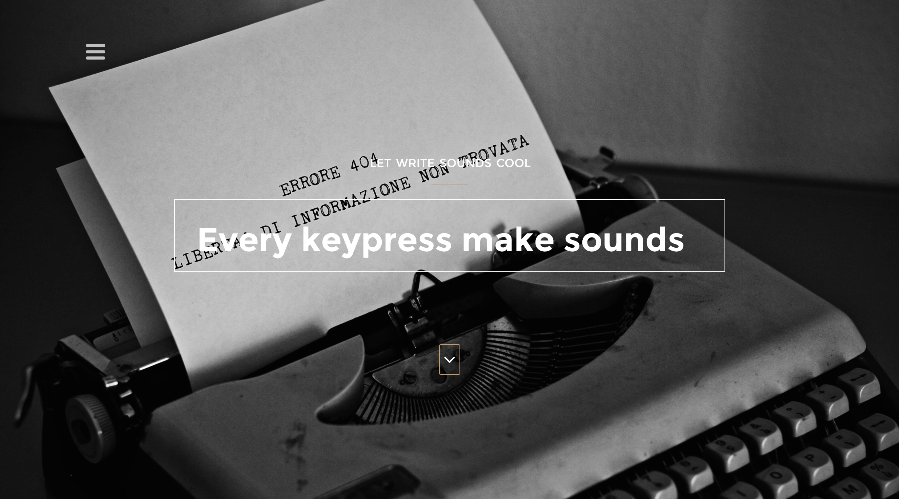
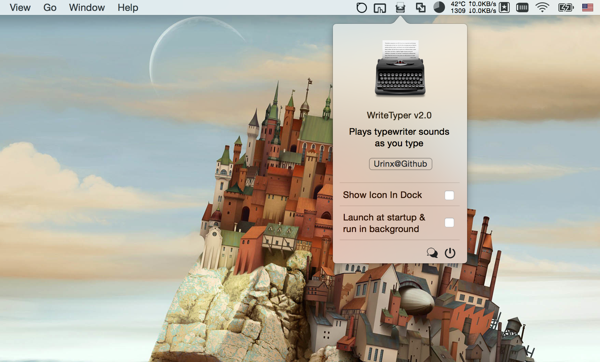

# WriteTyper
復古打字機 — Mac OS X App [官网](http://urinx.github.io/app/writetyper)

### About
This WriteTyper app works on Mac OS X 10.10+, writen in `Swift 2.0`, based on NoisyTyper. It can make old typewriter sounds when you keypress, let you more enjoy the time of coding or writing.

### Install
> It's very easy to install this app.
> 
> Download the app, double click to run it. And then go to the System Preferences -> Security & Privacy, enable Accessibility for WriteTyper. At last, quit it and reopen.
> 
> Notice: for it to work, Accessibility for WriteTyper must be enabled.

### Screenshot

### Thanks

[gorlak / NoisyTyper](https://github.com/gorlak/NoisyTyper)
